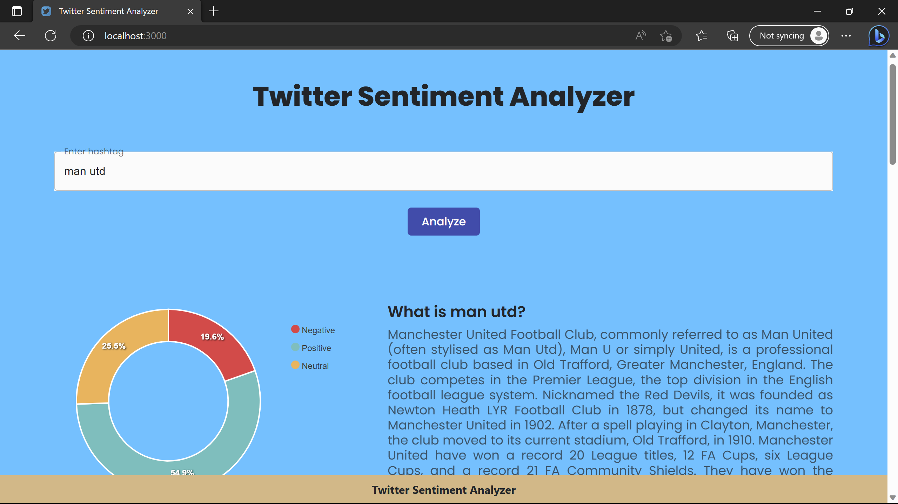
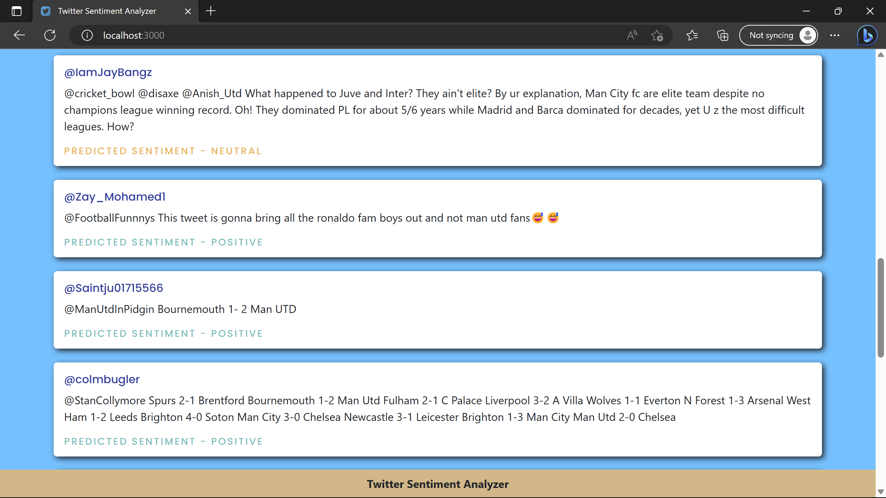

# Twitter-Sentiment-Analyzer

A Docker application made using Python(Flask) and React. In this application an user can search anything of his own intrest. The twitter api featches and provides with the tweets according to the search term. The fetched tweets are analysed using ML model. Few Tweets and overall analysed sentiment(in form of Pie Chart) are displayed to the user.    

## Prerequisites 
1. Docker 
2. Node Js
3. Twitter Developer Account

<picture> </picture>
<picture> </picture>

## How to Use

1. Download the [trained model](https://drive.google.com/file/d/1kTJFcahGH_7-Rj0MUiMZohmnWzUMFCBD/view?usp=sharing) and add it into the `server/main` folder  
2. Get Twitter API credentials [Twitter Developer Portal Projects & Apps page](https://developer.twitter.com/en/portal/projects-and-apps) and add them to the `/server/main/config.py` file.
3. Run `docker-compose up --build` in the terminal from the root folder   
4. Open `http://localhost:3000` in your browser to access the web app
